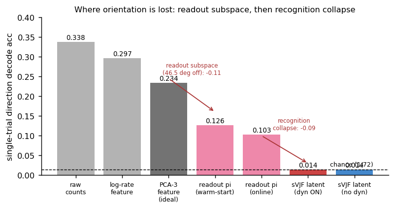
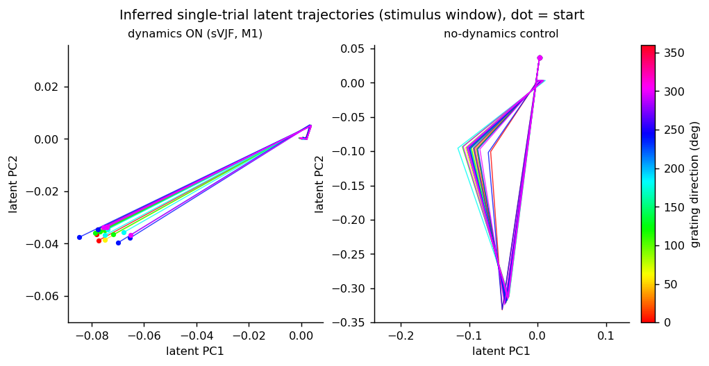
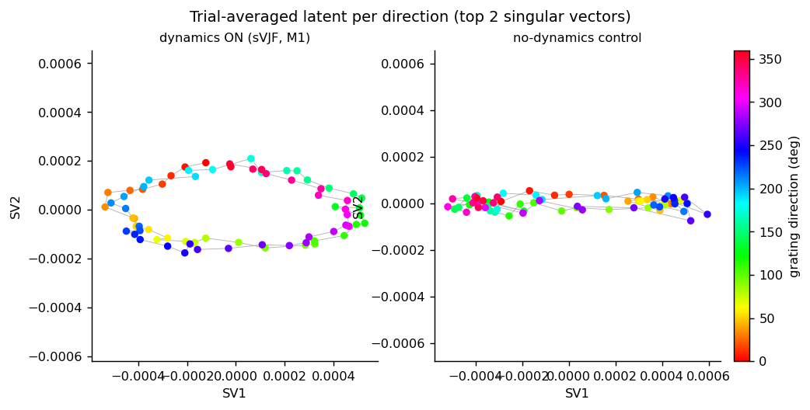
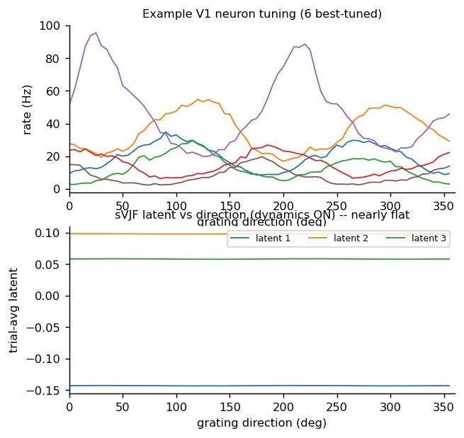
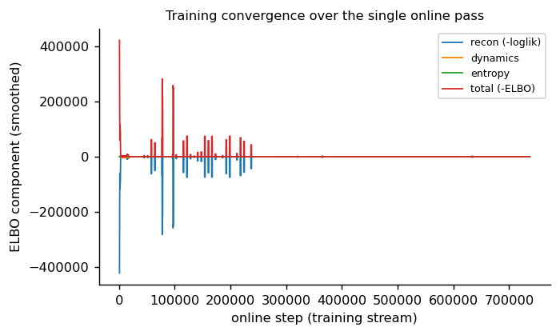

# sVJF on Graf V1 -- M1 diagnostic report (array_5 @ 10 ms, L=3)

**Date:** 2026-06-10. **Branch:** `feat/v1-graf` @ `ad2dacf`. **Audience:** Memming, Hyungju, Yuan.

## TL;DR

sVJF runs on real macaque V1 (Graf et al. 2011) -- stable, real-time (~2.7 ms/bin), single
streaming pass, unknown readout -- but **the filtered latent does not encode the stimulus**:
single-trial direction decode is at chance (0.014, chance 1/72) and leave-one-neuron-out PLL is
worse than a mean-rate baseline (-3.5 bits/spike). The orientation information *is* in the data
(a batch PCA-3 of the population decodes at 0.23). It is lost inside the **projection-encoder
pipeline**, in two stages: the online readout subspace is ~46 deg off the ideal (0.23 -> 0.13),
then the **recognition network collapses** the rest (0.13 -> chance). The autonomous dynamics are
**not** the cause -- turning the flow off changes nothing (still chance), and with the flow on the
trial-averaged latent even shows a faint orientation ring that the no-dynamics control lacks. This
is the classic Poisson **encoder collapse**, not a dynamics problem. The implementation is reviewed
and correct; the issue is the encoder/readout configuration.

## Setup

Graf array_5: 72 drifting-grating directions x 50 trials, 2560 ms/trial (first 1280 ms stimulus),
grating temporal freq 6.25 Hz, 74 well-tuned neurons (bimodal von Mises, R^2 >= 0.75). sVJF: L=3,
autonomous shared RBF flow (square-root RLS), projection encoder + two-timescale online readout
(CCIPCA, warm-started on a coverage window of 1 trial/direction), data-driven RBF centers, 10 ms
bins, 40 train / 10 test trials per direction, single online pass.

## M1 result

| metric | value | note |
|---|---|---|
| leave-one-neuron-out PLL | **-3.50 bits/spike** | worse than homogeneous-Poisson baseline |
| single-trial direction decode (filtered latent) | **0.014** | chance = 0.0139 |
| free-run forecast R^2 | 0.31 | the flow learned an autonomous cycle |
| per-bin compute | 2.72 ms (p95 3.30) | real-time at 10 ms bins |
| divergences | 0 | numerically stable |

## Where the orientation is lost (the key result)

Decoding grating direction from each stage of the pipeline (per-trial stimulus-window summary):

- The population feature carries orientation strongly (raw 0.34, log-rate 0.30, **batch PCA-3 0.23**).
- The **readout projection** pi = C^+(g~(y)-b) -- the recognition's *input* -- decodes at only
  **0.13** (warm-start C) / 0.10 (online CCIPCA C). The online readout subspace sits **46.5 deg**
  off the ideal PCA-3 subspace, roughly halving the orientation information.
- The **sVJF filtered latent** -- the recognition's *output* -- decodes at **chance (0.014)**, both
  with dynamics on and off. The recognition network discards the orientation still present in its
  input.

So two compounding losses: a suboptimal readout subspace, then a recognition collapse -- the latter
is catastrophic and dominant.

## The latent is collapsed

Inferred single-trial latent paths over the stimulus window. With dynamics ON (left) every trial
collapses onto essentially the **same 1-D ray** regardless of direction; the no-dynamics control
(right) is a similarly direction-agnostic narrow fan. The recognition maps the orientation-carrying
input onto a near-common, low-dimensional trajectory -- the posterior has collapsed.

Trial-averaging exposes a residual: with dynamics ON (left) the per-direction mean latent traces a
faint but real **orientation ring** (note the smooth color order around the loop) -- at magnitude
~2e-4, ~1000x smaller than the single-trial ray, so it cannot survive single-trial noise (hence
chance decode). The no-dynamics control (right) shows **no ring**. The dynamics are therefore mildly
*helpful* for organizing the average, not the cause of the failure.

The neurons are strongly orientation-tuned (top); the sVJF latent's dependence on direction is
near-flat at ~1e-4 (bottom) -- the collapse, seen directly.

Training is stable and the ELBO terms converge over the single pass; the collapse is not a
divergence or a failure to converge -- it converges *to* a collapsed encoder.

## Diagnosis

The dominant failure is a **Poisson encoder collapse**: under the per-step ELBO with sparse,
low-rate spikes the recognition network drives the posterior to a near-constant, low-variance latent,
discarding the orientation present in its input pi. The projection encoder (feeding pi instead of raw
spikes) *reduced* but did not *eliminate* this -- the same trivial-solution basin documented for the
readout (`CLAUDE.md`: "Poisson collapse"). A secondary loss is the online readout subspace being
~46 deg off the ideal, which halves the input information before the recognition even sees it. The
autonomous-oscillator design we worried about at brainstorming is **exonerated** by the control.

(My initial read -- "the oscillator dominates the posterior" -- was **refuted** by the no-dynamics
control: it decodes no better. The controls were worth running.)

## Recommended next steps (a design/config decision)

1. **Attack the encoder collapse directly** (highest priority): e.g. raise the posterior-variance
   floor / temper the entropy term, lengthen recognition warm-up, or pre-train the recognition to
   invert the projection (pi -> latent should be near-identity); verify the filtered latent then
   recovers ~0.1-0.2 decode (the pi ceiling).
2. **Fix the readout subspace**: the online CCIPCA C is 46 deg off PCA-3. More coverage
   trials/direction, a longer batch warm-start, or a better incremental-PCA schedule should pull pi
   from 0.13 toward the 0.23 batch-PCA-3 ceiling.
3. **Sanity ceiling to target**: a working projection-encoder latent must clear the pi decode (~0.13)
   and approach batch PCA-3 (0.23); that is the bar, not the oracle.

The dynamics design is fine; do not change it for this. M2 (5/1 ms) and the baselines plan (U5) stay
on hold pending the encoder-collapse fix.

## Reproduce

- `experiments/v1_graf/diag_m1.py` -- retrains run A (dynamics ON) + run B (no-dynamics control),
  dumps latents/convergence/torus/tuning to `results/diag_m1_array5_L3.npz` (gitignored).
- `experiments/v1_graf/diag_readout.py` -- the readout-pi localization (warm-start vs online C,
  subspace angle).
- `experiments/v1_graf/diag_pca_decode.py` -- the batch-PCA-3 / raw-feature decode baselines.
- `experiments/v1_graf/plot_diag.py` -- renders the five figures here.
- M1 metrics JSON: `gcp_runs/exp-20260609-221137-vjf-v1graf/results/m1_array5_bin10.0_L3.json`.
