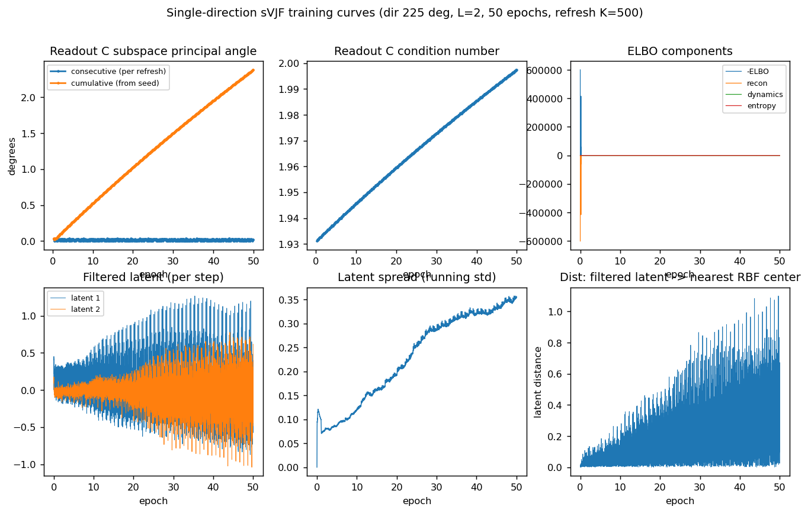
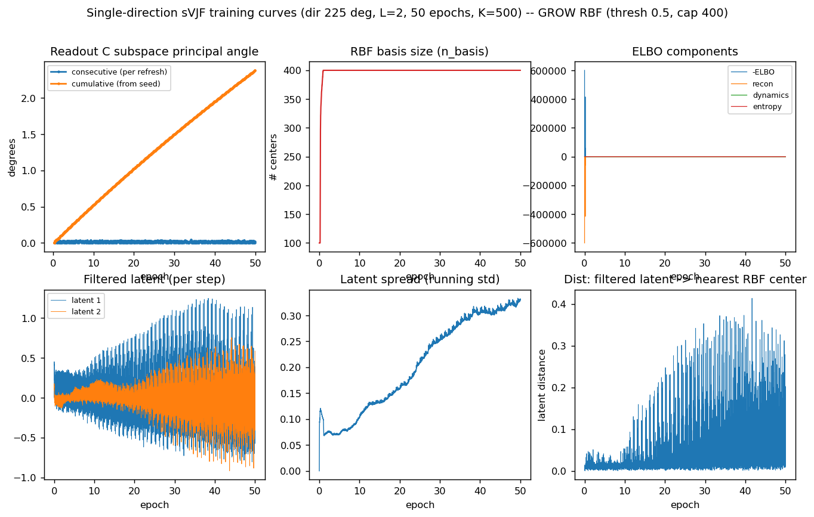
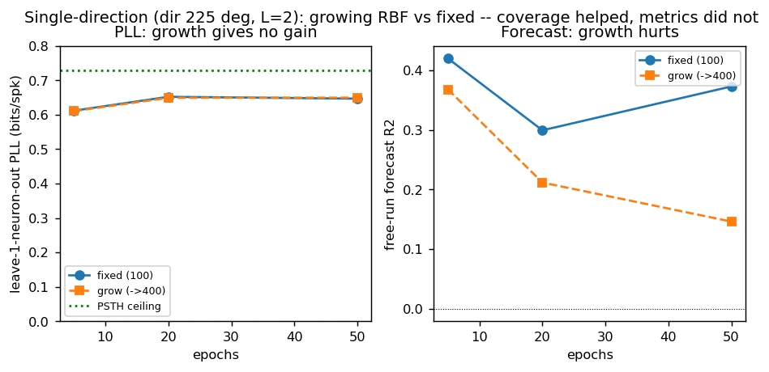
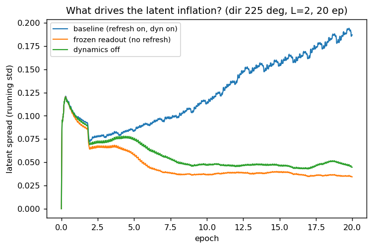

# Single-direction sVJF + growing-RBF report (Graf V1, array_5)

**Date:** 2026-06-10. **Branch:** `feat/v1-graf`. **Audience:** Memming, Hyungju, Yuan.
Follow-on to `REPORT_M1.md` (the full 72-direction M1 no-go). Scaled the task down to one
direction to isolate the machinery, then implemented and tested Memming's growing-RBF idea.

## TL;DR

1. **Scaled to a single direction, sVJF works.** One direction (auto-picked 225 deg, strongest
   response), L=2, unknown readout, online: leave-one-neuron-out PLL **+0.61..+0.65 bits/spike**
   (vs the stimulus-locked PSTH ceiling **+0.73**), free-run forecast R^2 **+0.30..+0.42**, stable.
   So the M1 failure was multi-condition scaling, not an inability to model V1.
2. **The drift is latent-scale inflation, not a rotating readout.** Over training the readout C
   subspace barely moves (cumulative principal angle **2.4 deg** over 50 epochs), but the latent
   amplitude **inflates ~5x** (running spread 0.07 -> 0.35, still rising), dragging the filtered
   latent ~27x off the once-seeded RBF centers (nearest-center distance 0.013 -> 0.35).
3. **Growing RBFs (implemented, codex-reviewed) fix coverage but not the metrics.** Adding a center
   whenever the state's max RBF activation < 0.5 (all centers far) keeps the basis on the latent
   (nearest-center distance 0.07 vs 0.35), but PLL is **unchanged** (~0.65) and forecast is **worse**
   (0.15..0.37 vs 0.30..0.42 fixed). RBF coverage was not the bottleneck.

## 1. Single-direction validation (machinery is sound)

Driver `single_dir.py`. 40 train / 10 test trials, trials replayed for E in {5,20,50} epochs
(per-trial latent reset), warm-up 8 trials, n_rbf=100, projection encoder + online readout + srrls,
L=2. Eval on held-out trials: leave-one-neuron-out PLL vs a stimulus-locked PSTH ceiling, forecast,
latent.

| epochs | PLL (bits/spk) | PSTH ceiling | forecast R^2 |
|---|---|---|---|
| 5  | 0.612 | 0.729 | 0.420 |
| 20 | 0.652 | 0.729 | 0.299 |
| 50 | 0.647 | 0.729 | 0.373 |

Converges by ~5-20 epochs, no overfit at 50. Honest caveat: PLL sits just *below* the PSTH ceiling
-- sVJF captures the stimulus-locked structure (~88% of ceiling) but does not yet *beat* the
trial-averaged-response predictor, i.e. it is not adding single-trial predictive power. (Figures:
`single_dir_latent_E*.png`, `single_dir_summary.png`.)

## 2. The drift: readout stable, latent inflates (`single_dir_traincurves.py`)

- Readout C subspace principal angle: cumulative **2.4 deg** over 50 epochs (per-refresh ~0.02 deg);
  condition number flat 1.9->2.0. The readout direction is stable.
- Filtered latent amplitude inflates (±0.3 -> ±1.0+); running spread 0.07 -> 0.35 (still climbing).
- Distance from the filtered latent to its nearest (fixed, once-seeded) RBF center grows 0.013 ->
  0.35 -- the latent inflates out of the seeded basis. This is the "centers end up far from the
  trajectories" effect, and it is **scale inflation**, not subspace rotation. (With C column-
  normalized there is a single scale gauge, so this is not a free-gauge drift -- the recognition/
  dynamics are driving the latent magnitude up.)

## 3. Growing RBFs: coverage yes, metrics no (`grow_rbf`, `single_dir_traincurves.py --grow`)

Implemented an additive, gated growing basis (`vjf/module.py` `LinearRegression.grow_basis`,
`vjf/model.py` `RBFDS._maybe_grow`): when the current predictor's max RBF activation < `grow_thresh`
(all existing centers far -- Memming's novelty rule), append a center there with a zero weight row
(predictions unchanged) and a fresh `sqrt(p0)` block in the square-root covariance factor; throttled
by `grow_min_gap`, capped by `max_rbf`. Codex-reviewed (square-root-RLS extension + no-perturbation
confirmed; a per-row-novelty batched-update fix applied). 44->... tests pass.

- Coverage fixed: nearest-center distance stays ~0.07 (vs 0.35 fixed).
- But `n_basis` **bursts 100 -> 400 (cap) within ~1 epoch**: once the latent leaves the tiny seed
  cloud, almost every step is "uncovered", so it adds rapidly until capped. Not "slow" growth -- the
  inflation drives it. The latent still inflates to the same 0.33 spread (growth accommodates, does
  not stop it).

| epochs | PLL fixed | PLL grow | forecast fixed | forecast grow |
|---|---|---|---|---|
| 5  | 0.612 | 0.610 | 0.420 | 0.368 |
| 20 | 0.652 | 0.649 | 0.299 | 0.212 |
| 50 | 0.647 | 0.650 | 0.373 | **0.146** |

**PLL unchanged; forecast worse.** The 400-center basis, burst-added along the *inflating*
trajectory, fits an expanding spiral rather than a clean limit cycle, so its autonomous free-run
degrades (worst at E=50). So **RBF coverage was not the limiting factor** for the predictive metrics.

## 4. What drives the inflation: a readout-refresh x dynamics feedback (`inflation_probe.py`)

Latent running spread over training (dir 225, L=2, 20 epochs), three arms:

| arm | final latent spread |
|---|---|
| baseline (refresh on, dynamics on) | 0.187 (inflates, 0.07 -> 0.19) |
| frozen readout (no refresh), dynamics on | 0.034 (flat) |
| dynamics off, refresh on | 0.045 (flat) |

The inflation needs BOTH the readout refresh AND the dynamics -- turning off either keeps the latent
flat. It is a positive feedback ratchet: the CCIPCA refresh rescales C by the latent's current
variance (the `sqrt(eigenvalue)` fold in `OnlineReadout._scaled_C`), the recognition compensates,
the flow amplifies, and the next refresh rescales again. **Freezing the readout after warm-start
kills it most cleanly** -- which is exactly the freeze/anneal recipe the synthetic study already
found ("freeze the refresh once converged recovers forecast"). So the V1 latent inflation and the
synthetic forecast-erosion are the same phenomenon, and the fix likely transfers.

## 5. Conclusion and recommended next lever

- The single-condition machinery is sound (PLL near ceiling), so the path forward is real.
- Growing RBFs is now a sound, tested, reviewed capability (kept in the library, off by default), but
  on this task it does not move PLL and hurts forecast -- coverage is not the bottleneck.
- The recurring root cause is **latent-scale control** (inflates single-direction, collapsed
  full-task). Sec 4 pins the single-direction inflation to the **readout-refresh x dynamics feedback**
  (CCIPCA `sqrt(eigenvalue)` rescaling), confirming the earlier suspicion. **Concrete next lever:
  freeze or anneal the readout refresh after warm-start** (already a recipe in the synthetic study and
  shown here to keep the latent flat at 0.034) and re-check PLL/forecast; this is a config change, no
  new machinery. Separately, *beating* the PSTH ceiling (genuine single-trial structure) likely needs
  readout/encoder work (the online readout subspace was ~46 deg off the data PCA-3 even for one
  direction).
- Two earlier hypotheses were tested and dropped: "the autonomous oscillator dominates" (refuted by
  the no-dynamics control, `REPORT_M1.md`) and "pin the latent scale" (not a coherent separate knob,
  per Memming). The data-driven landing point is the inflation above.

## Reproduce
- `single_dir.py [--grow]` -- PLL/forecast sweep over epochs (writes `results/single_dir_summary*.json`).
- `single_dir_traincurves.py [--grow]` -- the training-curve diagnostics (subspace angle, n_basis,
  latent spread, dist-to-center).
- `compare_grow.py` -- the grow-vs-fixed metric figure.
- `data_check_pca3d.py`, `latent_space_viz.py` -- the data-validation and latent-space figures.
